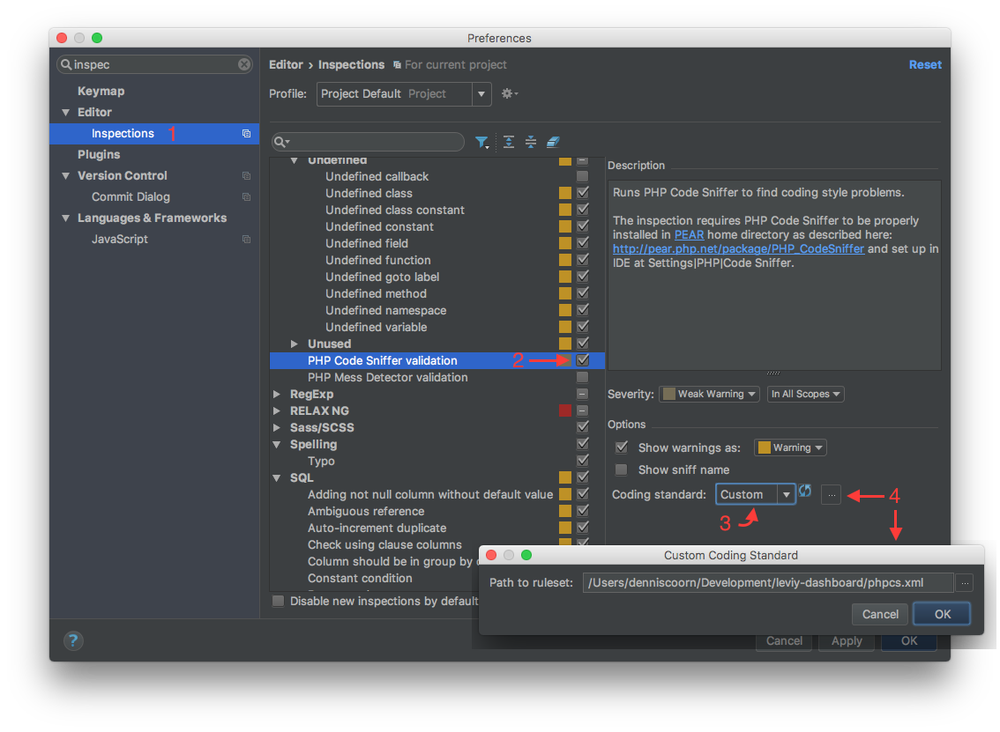

# LEVIY Coding Standard

[](https://travis-ci.org/leviy/php-coding-standard)
[](https://packagist.org/packages/leviy/coding-standard)
[](https://github.com/leviy/php-coding-standard/blob/master/composer.json)

The LEVIY coding standard for PHP code, with rulesets for
[PHP CodeSniffer](https://github.com/squizlabs/PHP_CodeSniffer) and
[PHP Mess Detector](https://phpmd.org/).

## Installation

Install this package using [Composer](https://getcomposer.org/):

```bash
composer require --dev leviy/coding-standard
```

### Installing the PHP CodeSniffer ruleset

Create a file `phpcs.xml` in the root of the project with the following contents:

```xml
<?xml version="1.0" encoding="UTF-8"?>
<ruleset>
    <rule ref="LEVIY"/>

    <config name="ignore_warnings_on_exit" value="1"/>

    <file>src/</file>
    <file>tests/</file>
    <file>public/index.php</file>
</ruleset>
```

### Installing the PHP Mess Detector ruleset

Create a file `phpmd.xml` in the root of the project with the following contents:

```xml
<?xml version="1.0" encoding="UTF-8"?>
<ruleset xmlns="http://pmd.sf.net/ruleset/1.0.0"
         xmlns:xsi="http://www.w3.org/2001/XMLSchema-instance"
         xsi:schemaLocation="http://pmd.sf.net/ruleset/1.0.0 http://pmd.sf.net/ruleset_xml_schema.xsd"
         name="Mess detector ruleset">
    <description>Ruleset for PHP Mess Detector that enforces coding standards</description>

    <rule ref="vendor/leviy/coding-standard/phpmd.xml"/>
</ruleset>
```
    
## Configuration

### PHP CodeSniffer

An annotated `ruleset.xml` configuration file can be found [here](https://github.com/squizlabs/PHP_CodeSniffer/wiki/Annotated-ruleset.xml)
where you can see the complete range of features and configuration options that can be used to modify the configuration to your project needs.

### PHP Mess Detector

Documentation about tweaking the ruleset and exluding rules or changing settings
can be found [here](https://phpmd.org/documentation/creating-a-ruleset.html).

## Usage
        
Run `vendor/bin/phpcs` to run PHP CodeSniffer. If you have a file `phpcs.xml` or
`phpcs.xml.dist` in root directory of the project, CodeSniffer will use it
automatically. Add a path to run CodeSniffer only against that
file or directory. See
[Usage](https://github.com/squizlabs/PHP_CodeSniffer/wiki/Usage) for more
detailed usage instructions.
        
Run `vendor/bin/phpmd src/ text phpmd.xml` to run PHP Mess Detector against the
`src` directory and print a report in the "text" format.

## PHPStorm code sniffer validation

1. Open "Preferences" and navigate to "Editor > Inspections".

2. Enable "PHP > PHP Code Sniffer validation".

3. Select a "Custom" coding standard.

4. Select the path to the projects code sniffer configuration.



**Enjoy the immediate feedback of code sniffer validation issues!**


